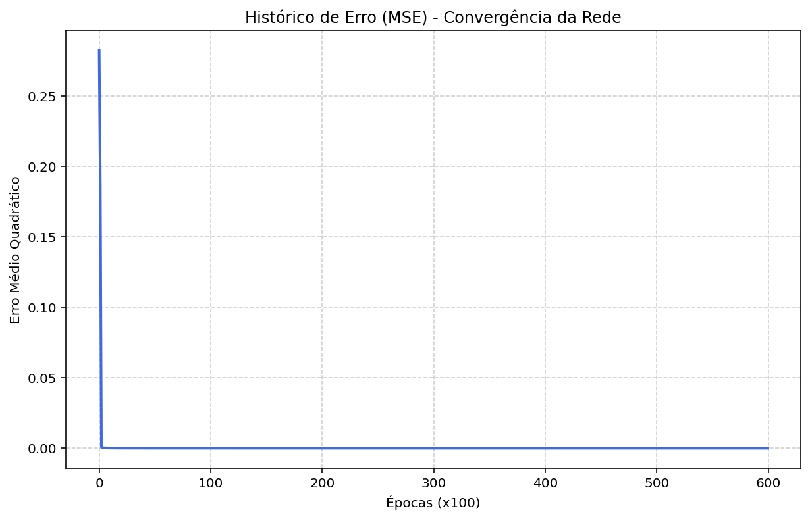

# XOR Neural Network

### Introdução
Este é um projeto simples que consiste na implementação de uma rede neural multicamada para identificação do operador lógico `XOR`, desenvolvida em **Python** com foco em operações matriciais via **NumPy**. 

A motivação do projeto se dá pelo fato de a identificação do **XOR** ser um **problema não linearmente separável** (diferentemente de outros operadores como AND e OR). Ao colocar as quatro possíveis entradas binárias do operador lógico como pontos em um plano cartesiano, é impossível traçar uma única linha que as separe de acordo com o seu tipo de retorno (0 ou 1). Por isso, o processo de predição exige uma arquitetura de rede mais elaborada, com camadas ocultas.


### Estrutura do Projeto
* **`neural_network.py`**: Contém a implementação da classe `NeuralNetwork`, onde toda a lógica de *backpropagation* e ajuste de pesos (*gradient descent*) foi construída.
* **`main.py`**: Script principal que realiza a orquestração do projeto, instanciando o objeto `brain`, treinando o modelo e validando o aprendizado da rede através de testes práticos.

### Tecnologias Utilizadas
* **Python**
* **NumPy** (Processamento vetorial e matricial)
* **Matplotlib** (Geração de gráficos para análise de performance)

## Resultados
Após o treinamento (aprox. 60.000 épocas), a rede é capaz de convergir o erro para próximo de zero, alcançando as seguintes saídas:

| Entrada (X1, X2) | Saída Esperada | Saída da Rede (Arredondada) |
|:---:|:---:|:---:|
| 0, 0 | 0 | 0.0 |
| 0, 1 | 1 | 1.0 |
| 1, 0 | 1 | 1.0 |
| 1, 1 | 0 | 0.0 |

### Como Executar
1. Clone este repositório:
   ```bash
   git clone [https://github.com/Gabriel4871/XOR-Neural-Net.git](https://github.com/Gabriel4871/XOR-Neural-Net.git)
2. Instale as dependências necessárias:
   ```bash
   pip install numpy matplotlib
3. Execute o script principal:
   ```bash
   python main.py

## Decaimento do Erro


